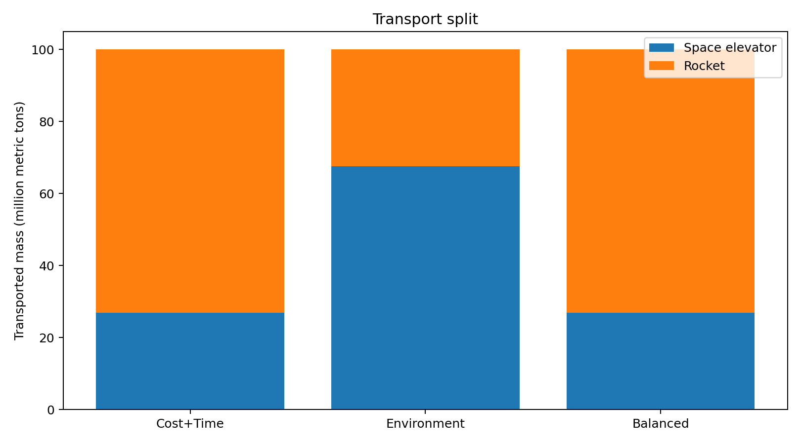
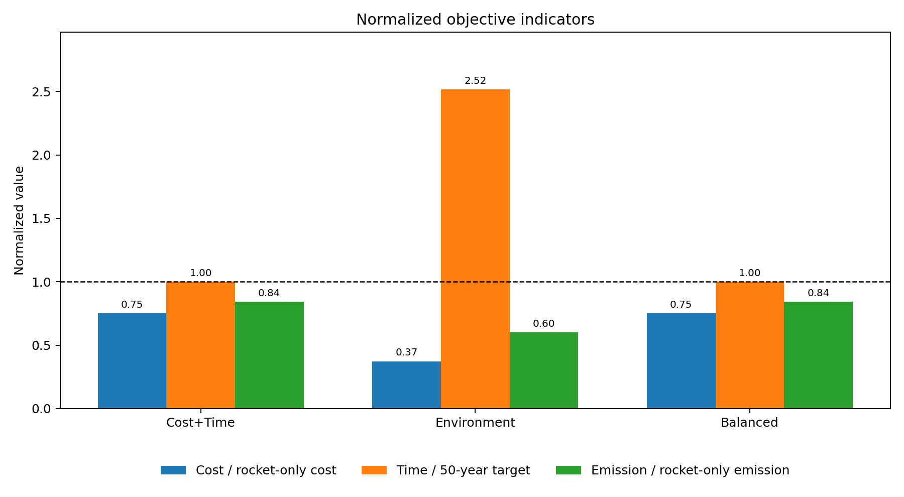
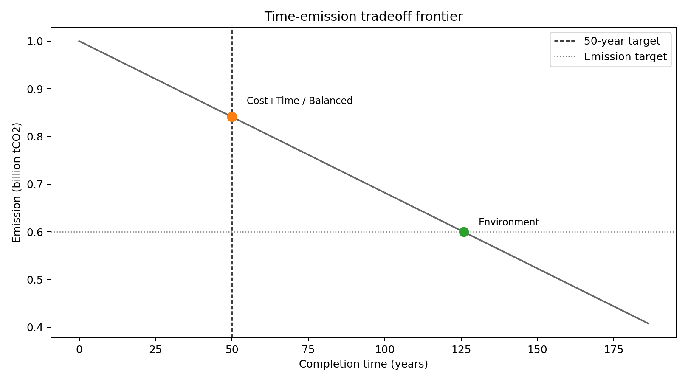
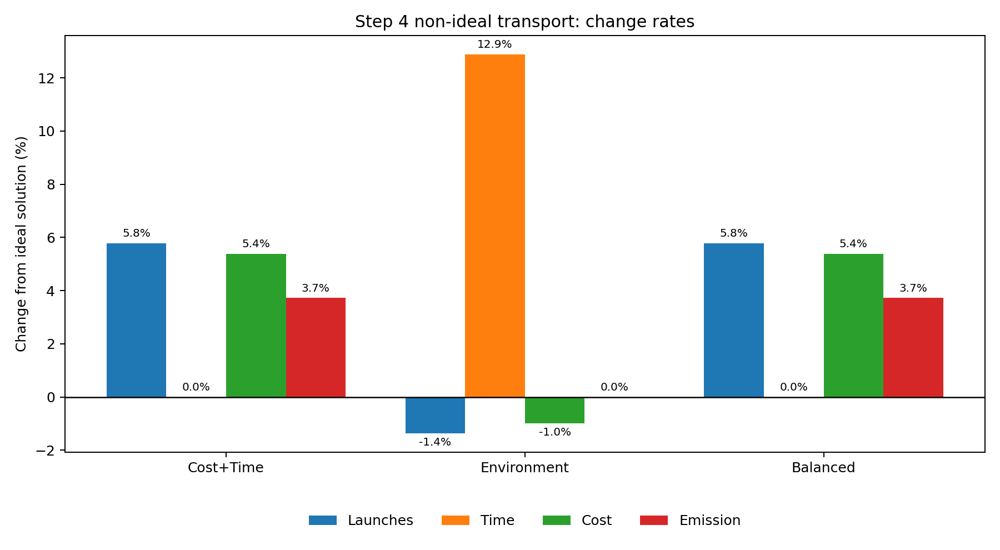
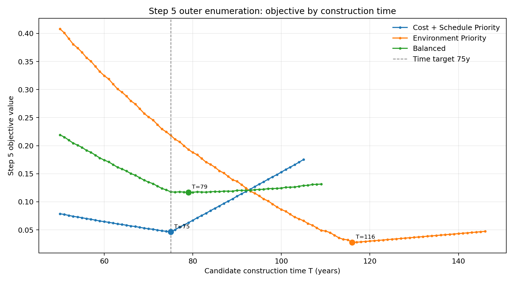
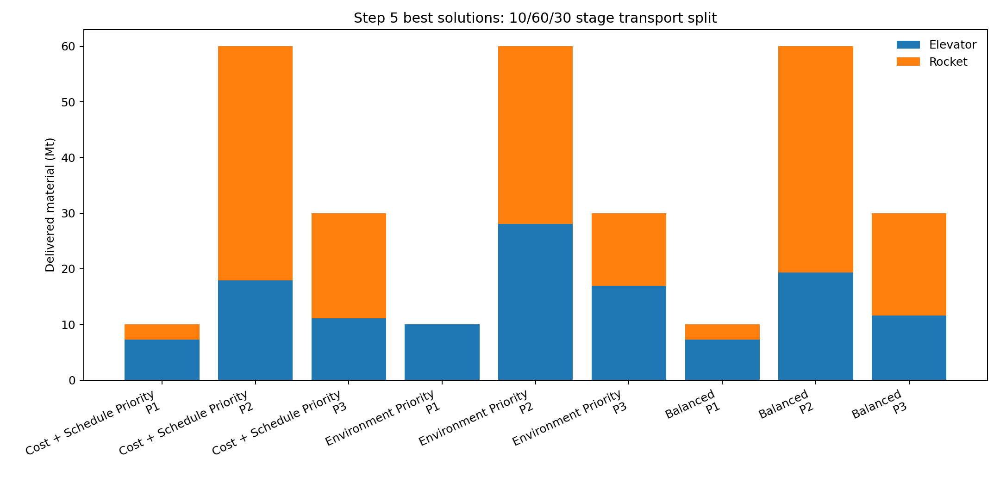
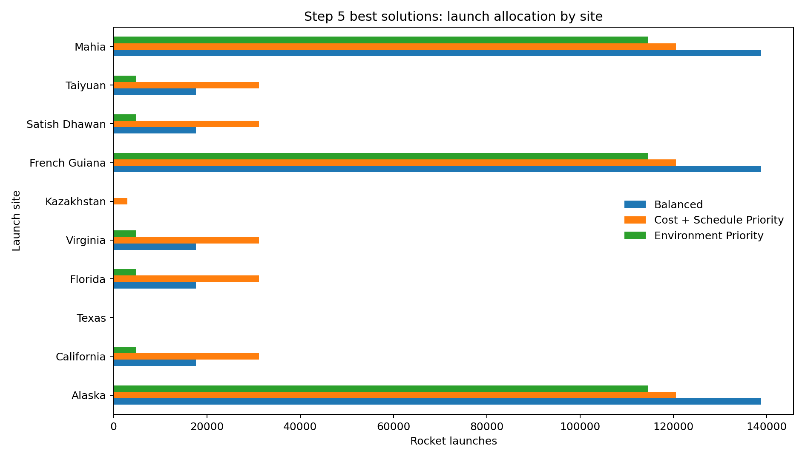

  

    
运筹学期末大作业

    <h1>面向月球基地建设的 材料运输优化方案</h1>
    
从“地月运输设想”到“可计算的多目标运输规划模型”

    

      目标规划
      整数规划
      运输问题
      多目标决策
    

  

  

---
layout: section
---

# 目录

  
01问题叙述

  
02基础模型建模

  
03基础模型求解结果

  
04非完美工作情况建模

  
05非完美工作情况求解

  
06扩展模型建模

  
07扩展模型求解

  
08结论

---
layout: section
---

# 01 问题叙述

先把题目讲清楚：我们到底要帮谁做什么决策。

---

# 我们面对的实际问题

  

    <b>背景</b>
    
选题改编自 2026 MCM Problem B：用太空电梯系统支持月球基地建设。

  

  

    <b>任务</b>
    
从地球向月球运输约 100,000,000 公吨建设材料。

  

  

    <b>决策</b>
    
在太空电梯和传统火箭之间分配运输任务。

  

  

    <b>评价</b>
    
比较成本、工期、环境影响，并给出可解释方案。

  

  本质不是“选电梯还是选火箭”，而是一个多目标运输资源配置问题。

---

# 题目给出的关键运输条件

  

    <h3>太空电梯系统</h3>
    <ul>
      <li>由 3 个 Galactic Harbours 组成</li>
      <li>单个港口年运力：179,000 公吨/年</li>
      <li>系统总年运力：537,000 公吨/年</li>
      <li>低成本、低排放，但运力固定</li>
    </ul>
  

  

    <h3>传统火箭系统</h3>
    <ul>
      <li>题目列出 10 个候选发射场</li>
      <li>2050 年单次月面有效载荷：100--150 公吨</li>
      <li>本文主值取 125 公吨/次</li>
      <li>灵活补充运力，但成本和排放较高</li>
    </ul>
  

  <Formula tex="M=100\text{ Mt},\quad Q_E=0.537\text{ Mt/year},\quad q_R=0.000125\text{ Mt/launch}" />

---

# 我们如何确定要查哪些数据

  

    1
    <b>先写评价指标</b>
    
成本 <Formula tex="C" />、工期 <Formula tex="T" />、环境影响 <Formula tex="G" />

  

  

    2
    <b>再反推所需参数</b>
    
运力、载荷、单价、排放、可用率

  

  

    3
    <b>区分模型阶段</b>
    
基础模型、非完美模型、扩展模型分别需要不同数据

  

  

    4
    <b>保留推算口径</b>
    
网络公开资料 + 题目条件 + 工程近似推算

  

<table class="compact-table mt-6">
  <thead>
    <tr><th>数据类型</th><th>进入哪个模型</th><th>作用</th></tr>
  </thead>
  <tbody>
    <tr><td>电梯成本、能耗、运力</td><td>基础/非完美/扩展</td><td>计算电梯运输成本和排放</td></tr>
    <tr><td>火箭载荷、成本、排放</td><td>基础/非完美/扩展</td><td>计算发射次数、成本和排放</td></tr>
    <tr><td>可用率 <Formula tex="a_E,a_R" /></td><td>非完美模型</td><td>修正有效运输能力</td></tr>
    <tr><td>发射场敏感系数 <Formula tex="s_i" /></td><td>扩展模型</td><td>体现发射场环境差异</td></tr>
  </tbody>
</table>

---

# 从现实问题到运筹学问题

  
月球基地材料运输

  
运输需求 <Formula tex="M=100" /> Mt

  
运输通道 电梯 / 火箭

  
决策变量 运输量与发射次数

  
硬约束 需求、运力、载荷

  
多目标 成本、时间、环境

  
求解方法 MILP + 搜索

  课程知识对应：运输问题、线性规划、整数规划、目标规划、非线性规划近似。

---
layout: section
---

# 02 基础模型建模

先在完美工作状态下建立一个清楚、标准、可求解的主模型。

---

# 基础模型的建模思路

  

    <h3>我们考虑什么</h3>
    <ul>
      <li>必须完成 100 Mt 材料运输</li>
      <li>电梯有固定年运力上限</li>
      <li>火箭按整数次发射</li>
      <li>同时评价成本、工期、环境影响</li>
    </ul>
  

  

    <h3>基础模型暂时省略什么</h3>
    <ul>
      <li>不区分每个发射场的逐年调度</li>
      <li>不设置单个发射场硬性发射上限</li>
      <li>不考虑系统故障与延期</li>
      <li>不考虑技术随时间变化</li>
    </ul>
  

  目的：先得到一个能解释“电梯和火箭各承担多少”的基础答案。

---

# 基础模型变量与目标

  

    <h3>决策变量</h3>
    <table class="compact-table">
      <tbody>
        <tr><td><Formula tex="x_E" /></td><td>太空电梯运输量</td></tr>
        <tr><td><Formula tex="x_R" /></td><td>火箭运输量</td></tr>
        <tr><td><Formula tex="n_R" /></td><td>火箭总发射次数，整数</td></tr>
        <tr><td><Formula tex="T" /></td><td>总运输周期</td></tr>
      </tbody>
    </table>
  

  

    <h3>三个评价指标</h3>
    

      <Formula display tex="C=c_Ex_E+f_Rn_R" />
      <Formula display tex="G=g_Ex_E+g_Rn_R" />
      <Formula display tex="T=\text{运输完成时间}" />
    

  

  
<b>成本+工期优先</b>0.45 / 0.40 / 0.15

  
<b>环境优先</b>0.10 / 0.05 / 0.85

  
<b>均衡</b>0.30 / 0.25 / 0.45

---

# 基础模型：目标规划形式

<Formula display tex="\min Z=
w_C\frac{d_C^+}{C^*}
+w_T\frac{d_T^+}{T^*}
+w_G\frac{d_G^+}{G^*}" />

<Formula display tex="\begin{aligned}
\text{s.t.}\quad
&amp; C=c_Ex_E+f_Rn_R, \\
&amp; G=g_Ex_E+g_Rn_R, \\
&amp; C+d_C^- - d_C^+=C^*, \\
&amp; T+d_T^- - d_T^+=T^*, \\
&amp; G+d_G^- - d_G^+=G^*, \\
&amp; x_E+x_R\ge M, \\
&amp; x_E\le Q_ET, \\
&amp; x_R\le q_Rn_R, \\
&amp; x_E,x_R,T,d^\pm_C,d^\pm_T,d^\pm_G\ge0, \\
&amp; n_R\in\{0,1,2,\ldots\}.
\end{aligned}" />

  只惩罚正偏差：成本、工期、排放超过目标值才进入目标函数。

---

# 基础模型属于什么运筹学模型

  

    <b>运输问题</b>
    
把总需求 <Formula tex="M" /> 分配给电梯和火箭两个运输通道。

  

  

    <b>线性规划</b>
    
成本、排放、运力约束均可写成线性表达。

  

  

    <b>整数规划</b>
    
火箭发射次数 <Formula tex="n_R" /> 不能取小数。

  

  

    <b>目标规划</b>
    
成本、工期、环境三个目标通过偏差变量统一处理。

  

  求解方法：用 HiGHS 求解混合整数线性规划；再用一维整数搜索复核。

---
layout: section
---

# 03 基础模型求解结果

先看两个极端方案，再解释混合方案为什么更合理。

---

# 极端方案：两个 benchmark

  

    <b>仅用太空电梯</b>
    <strong>186.22 年</strong>
    成本 10.00 trillion USD
    排放 0.408 billion tCO2
  

  

    <b>仅用火箭</b>
    <strong>800,000 次</strong>
    成本 142.40 trillion USD
    排放 1.000 billion tCO2
  

  
电梯：便宜、清洁，但太慢

  
火箭：可压缩工期，但发射次数和代价巨大

  
混合：用火箭补电梯的时间短板

---

# 完美工作状态下的混合方案

<table class="result-table">
  <thead>
    <tr>
      <th>情景</th><th>电梯 Mt</th><th>火箭 Mt</th><th>发射次数</th><th>工期</th><th>成本</th><th>排放</th>
    </tr>
  </thead>
  <tbody>
    <tr><td>成本+工期优先</td><td>26.850</td><td>73.150</td><td>585,200</td><td>50.00 年</td><td>106.851 TUSD</td><td>0.841 Bt</td></tr>
    <tr><td>环境优先</td><td>67.568</td><td>32.432</td><td>259,459</td><td>125.82 年</td><td>52.940 TUSD</td><td>0.600 Bt</td></tr>
    <tr><td>均衡</td><td>26.850</td><td>73.150</td><td>585,200</td><td>50.00 年</td><td>106.851 TUSD</td><td>0.841 Bt</td></tr>
  </tbody>
</table>

  基础模型里，50 年目标很强。成本+工期优先和均衡情景都选择“电梯尽量用满 50 年，其余靠火箭补足”。

---

# 图表：运输结构和归一化指标

  
  

  左图显示电梯/火箭运输量分配；右图显示三类评价指标的归一化对比。

---

# 结构化降维的小技巧

  

    <h3>为什么能降维</h3>
    
基础模型不限制单个发射场，因此方案可由火箭总发射次数 <Formula tex="n_R" /> 唯一确定。

  

  

    <Formula display tex="x_R=q_Rn_R" />
    <Formula display tex="x_E=M-x_R" />
    <Formula display tex="T=\frac{x_E}{Q_E}" />
  

  枚举 <Formula tex="n_R=0,\ldots,800000" />，直接计算 <Formula tex="C,T,G,Z" />。与 HiGHS MILP 结果最大差异约 <Formula tex="1.56\times10^{-13}" />，可视为一致。

---
layout: section
---

# 04 非完美工作情况建模

现实系统不会永远满负荷、零故障运行，所以要检查解的稳定性。

---

# 为什么要考虑非完美工作状态

  

    <b>太空电梯</b>
    
维护停机、调度间隔、结构检查会降低有效年运力。

  

  

    <b>火箭系统</b>
    
天气、技术检查、发射延期或任务失败会降低有效交付能力。

  

  

    <b>本文处理方式</b>
    
不把风险成本加入目标函数，只把有效运输能力打折。

  

  主情景：<Formula tex="a_E=0.90,\quad a_R=0.98" />

---

# 非完美模型：在基础模型上改两条约束

<Formula display tex="\min Z=
w_C\frac{d_C^+}{C^*}
+w_T\frac{d_T^+}{T^*}
+w_G\frac{d_G^+}{G^*}" />

<Formula display tex="\begin{aligned}
\text{s.t.}\quad
&amp; C=c_Ex_E+f_Rn_R, \quad G=g_Ex_E+g_Rn_R, \\
&amp; C+d_C^- - d_C^+=C^*, \\
&amp; T+d_T^- - d_T^+=T^*, \\
&amp; G+d_G^- - d_G^+=G^*, \\
&amp; x_E+x_R\ge M, \\
&amp; x_E\le a_EQ_ET, \\
&amp; x_R\le a_Rq_Rn_R, \\
&amp; x_E,x_R,T,d^\pm_C,d^\pm_T,d^\pm_G\ge0, \\
&amp; n_R\in\{0,1,2,\ldots\}.
\end{aligned}" />

  和基础模型相比，只把 <Formula tex="Q_E" /> 改成 <Formula tex="a_EQ_E" />，把 <Formula tex="q_R" /> 改成 <Formula tex="a_Rq_R" />。

---

# 非完美模型的运筹学意义

  

    <b>敏感性分析</b>
    
观察可用率下降后，最优运输结构如何变化。

  

  

    <b>目标规划保持不变</b>
    
目标权重和目标值不变，便于与基础模型对比。

  

  

    <b>仍可一维搜索</b>
    
非完美模型仍可通过枚举火箭发射次数求解。

  

  这一层模型不追求“更复杂”，而是回答：原来的方案在运输不完美时会偏移多少？

---
layout: section
---

# 05 非完美工作情况求解

有效运力下降后，系统主要用更多火箭发射来补偿。

---

# 非完美工作状态下的最优解

<table class="result-table">
  <thead>
    <tr>
      <th>情景</th><th>电梯 Mt</th><th>火箭 Mt</th><th>发射次数</th><th>工期</th><th>成本</th><th>排放</th>
    </tr>
  </thead>
  <tbody>
    <tr><td>成本+工期优先</td><td>24.165</td><td>75.835</td><td>619,062</td><td>50.00 年</td><td>112.610 TUSD</td><td>0.872 Bt</td></tr>
    <tr><td>环境优先</td><td>68.648</td><td>31.352</td><td>255,931</td><td>142.04 年</td><td>52.421 TUSD</td><td>0.600 Bt</td></tr>
    <tr><td>均衡</td><td>24.165</td><td>75.835</td><td>619,061</td><td>50.00 年</td><td>112.609 TUSD</td><td>0.872 Bt</td></tr>
  </tbody>
</table>

  在坚持 50 年完成的情景中，电梯有效运力下降后，模型只能增加火箭发射次数。

---

# 图表：相对完美工作状态的变化率

  成本+工期优先和均衡情景：火箭发射次数增加约 5.79%，成本增加约 5.39%，排放增加约 3.73%。

---

# 非完美结果的合理性分析

  

    <h3>工期目标强</h3>
    
如果仍要 50 年完成，减少的电梯有效运力必须由火箭补上。

  

  

    <h3>环境优先会拖长工期</h3>
    
它宁愿把工期拉到 142.04 年，也不显著增加排放。

  

  

    <h3>结论没有被推翻</h3>
    
非完美状态提高火箭补偿需求，但混合运输仍是合理结构。

  

  基础模型给出的是“理想运行下的方案”；非完美模型说明了这个方案对系统可用率的敏感程度。

---
layout: section
---

# 06 扩展模型建模

把问题从“总量分配”推进到“长期工程调度”。

---

# 为什么还要扩展模型

  
基础模型不足

  

    <b>发射场不同</b>
    
同样的发射次数，在不同地点造成的环境影响不同。

  

  

    <b>环境影响非线性</b>
    
连续多年高频发射可能带来累积压力。

  

  

    <b>施工节奏不同</b>
    
建设前期、中期、后期材料需求强度不同。

  

  

    <b>技术会进步</b>
    
几十年建设期内，火箭成本和排放可能逐年下降。

  

  扩展模型不设置月球基地最大接收能力，也不设置单个发射场硬性年发射上限。

---

# 扩展模型新增变量

<table class="compact-table large">
  <thead>
    <tr><th>符号</th><th>含义</th><th>为什么需要</th></tr>
  </thead>
  <tbody>
    <tr><td><Formula tex="n_{i,t}" /></td><td>第 <Formula tex="i" /> 个发射场第 <Formula tex="t" /> 年发射次数</td><td>把火箭总量拆成发射场-年份调度</td></tr>
    <tr><td><Formula tex="y_{E,t}" /></td><td>第 <Formula tex="t" /> 年电梯运输量</td><td>描述多时期电梯运力使用</td></tr>
    <tr><td><Formula tex="y_{R,t}" /></td><td>第 <Formula tex="t" /> 年火箭有效运输量</td><td>连接发射次数和运输量</td></tr>
    <tr><td><Formula tex="S_{i,t}" /></td><td>发射场环境压力存量</td><td>描述历史高频发射的残留压力</td></tr>
    <tr><td><Formula tex="u_k^+,u_k^-" /></td><td>建设阶段比例偏差</td><td>保证 10/60/30 运输节奏</td></tr>
  </tbody>
</table>

  <Formula display tex="y_{R,t}=a_Rq_R\sum_i n_{i,t},\qquad
  S_{i,t}=\rho_iS_{i,t-1}+n_{i,t}" />

---

# 扩展模型的现实条件表达

  

    <h3>施工节奏：10 / 60 / 30</h3>
    
前期基础设施 10%，中期主体建设 60%，后期扩容完善 30%。总工期 <Formula tex="T" /> 不预先固定，而是枚举比较。

    

      <Formula tex="P_1(T),P_2(T),P_3(T)" />
    

  

  

    <h3>技术进步</h3>
    
火箭单次成本和排放随时间下降，使较长建设周期可能变得更经济。

    

      <Formula tex="f_{R,t}=f_R(1-\lambda_f)^{t-1}" />
       
      <Formula tex="g_{R,t}=g_R(1-\lambda_g)^{t-1}" />
    

  

  <h3>综合环境损害</h3>
  

    <Formula display tex="H_{env}=\sum_t g_Ey_{E,t}
    +\sum_{i,t}s_ig_{R,t}n_{i,t}
    +\beta\sum_{i,t}s_iS_{i,t}^2" />
  

---

# 扩展模型：完整优化表达

<Formula display tex="T^* \in \arg\min_{T\in\mathcal{T}} Z_5^*(T)" />

<Formula display tex="Z_5^*(T)=
\min\ 
w_C\frac{d_C^+}{C^*}
+w_T\frac{d_T^+}{75}
+w_H\frac{d_H^+}{H^*}
+w_P\sum_{k=1}^{3}(u_k^++u_k^-)" />

<Formula display tex="\begin{aligned}
\text{s.t.}\quad
&amp; \sum_{t=1}^{T}(y_{E,t}+y_{R,t})\ge M, \\
&amp; y_{E,t}\le a_EQ_E,\quad t=1,\ldots,T,\\
&amp; y_{R,t}=a_Rq_R\sum_{i\in I}n_{i,t},\\
&amp; S_{i,t}=\rho_iS_{i,t-1}+n_{i,t},\\
&amp; \sum_{t\in P_k(T)}(y_{E,t}+y_{R,t})+u_k^- -u_k^+=p_kM,\\
&amp; C=\sum_t c_Ey_{E,t}+\sum_{i,t}f_{R,t}n_{i,t},\\
&amp; H_{env}=\sum_t g_Ey_{E,t}+\sum_{i,t}s_ig_{R,t}n_{i,t}
+\beta\sum_{i,t}s_iS_{i,t}^2,\\
&amp; C+d_C^- -d_C^+=C^*,\quad T+d_T^- -d_T^+=75,\quad H_{env}+d_H^- -d_H^+=H^*,\\
&amp; y_{E,t},y_{R,t},S_{i,t},u_k^\pm,d_C^\pm,d_T^\pm,d_H^\pm\ge0,\quad n_{i,t}\in\{0,1,2,\ldots\}.
\end{aligned}" />

---

# 扩展模型的求解方法

  

    1
    <b>外层枚举工期 <Formula tex="T" /></b>
    
从 50 年开始逐年枚举。

  

  

    2
    <b>划分建设阶段</b>
    
按 <Formula tex="P_1,P_2,P_3" /> 满足 10/60/30。

  

  

    3
    <b>优先使用电梯</b>
    
每阶段先用电梯有效运力。

  

  

    4
    <b>火箭凸二次调度</b>
    
在发射场和年份间分配发射次数。

  

  扩展模型带有整数变量和二次环境项，严格形式接近混合整数非线性规划；本文采用“外层枚举 + 内层凸二次近似”的可解释求解策略。

---
layout: section
---

# 07 扩展模型求解

考虑长期工程因素后，最优工期不再被压在 50 年。

---

# 扩展模型三种情景的最优解

<table class="result-table">
  <thead>
    <tr>
      <th>情景</th><th>最优工期</th><th>电梯 Mt</th><th>火箭 Mt</th><th>发射次数</th><th>成本</th><th>CO2</th><th>环境损害</th>
    </tr>
  </thead>
  <tbody>
    <tr><td>成本+工期优先</td><td>75 年</td><td>36.247</td><td>63.753</td><td>520,430</td><td>75.786 TUSD</td><td>0.708 Bt</td><td>0.785</td></tr>
    <tr><td>环境优先</td><td>116 年</td><td>54.947</td><td>45.053</td><td>367,782</td><td>50.625 TUSD</td><td>0.592 Bt</td><td>0.600</td></tr>
    <tr class="highlight-row"><td>均衡</td><td>79 年</td><td>38.180</td><td>61.820</td><td>504,649</td><td>74.295 TUSD</td><td>0.701 Bt</td><td>0.738</td></tr>
  </tbody>
</table>

  推荐关注均衡方案：79 年完成，既不过度追求 50 年速度，也不把工期拉到 100 年以上。

---

# 为什么工期会变成 75--116 年

  目标函数同时受工期偏差、成本下降、环境损害和施工节奏影响。技术进步让“稍微等待”有收益，但超过一定工期后时间偏差会开始主导。

---

# 阶段运输结果：满足 10 / 60 / 30

  
<b>前期</b>基础设施与启动能力

  
<b>中期</b>主体结构与防护材料高峰

  
<b>后期</b>扩容、冗余和完善

---

# 发射场分配：环境敏感性引导调度

  模型倾向于把更多发射分配给环境敏感系数较低的发射场，同时保留部分分散调度，避免单点连续高压运行。

---

# 扩展结果的合理性

  

    <h3>相比基础 50 年方案</h3>
    <ul>
      <li>火箭运输量下降</li>
      <li>成本显著下降</li>
      <li>环境损害更低</li>
      <li>工期更符合大型长期工程</li>
    </ul>
  

  

    <h3>相比环境优先方案</h3>
    <ul>
      <li>均衡方案没有把工期拖到 116 年</li>
      <li>仍保留较高电梯运输比例</li>
      <li>可作为更现实的推荐方案</li>
    </ul>
  

  扩展模型的价值不是“替代基础模型”，而是解释：当长期工程因素加入后，推荐方案为什么会从 50 年转向约 79 年。

---
layout: section
---

# 08 结论

我们最终得到的不是一个单点答案，而是一套可解释的决策框架。

---

# 三层模型给出的结论链条

  

    基础模型
    
确认混合运输优于单一运输方式，并给出三组权重下的总量分配。

  

  

    非完美模型
    
验证系统可用率下降不会推翻混合运输结论，但会增加火箭补偿需求。

  

  

    扩展模型
    
考虑施工节奏、环境敏感性、非线性环境压力和技术进步，得到更适合长期工程的方案。

  

---

# 推荐方案

  
扩展模型均衡方案

  

    
<b>79 年</b>总运输周期

    
<b>38.180 Mt</b>太空电梯运输量

    
<b>61.820 Mt</b>火箭运输量

    
<b>504,649 次</b>火箭发射次数

    
<b>74.295 TUSD</b>总成本

    
<b>0.701 BtCO2</b>物理 CO2 排放

  

  这个方案比基础 50 年方案更能体现长期工程中的技术进步和环境调度；也比环境优先方案更容易接受。

---

# 课程知识如何落到本题

  
<b>线性规划</b>成本、排放、运力约束

  
<b>运输问题</b>把需求分配到电梯和火箭通道

  
<b>目标规划</b>成本、工期、环境三目标折中

  
<b>整数规划</b>火箭发射次数必须为整数

  
<b>非线性规划思想</b>扩展模型中环境压力二次项

  
<b>方法对比</b>MILP、一维搜索、外层枚举与近似调度

---

# 最后一句话

  对超大规模月球基地建设运输问题，单一方案不可取。 
  运筹学模型的作用，是把“快、便宜、低污染”之间的冲突变成可以计算、比较和解释的决策方案。

谢谢各位老师和同学

